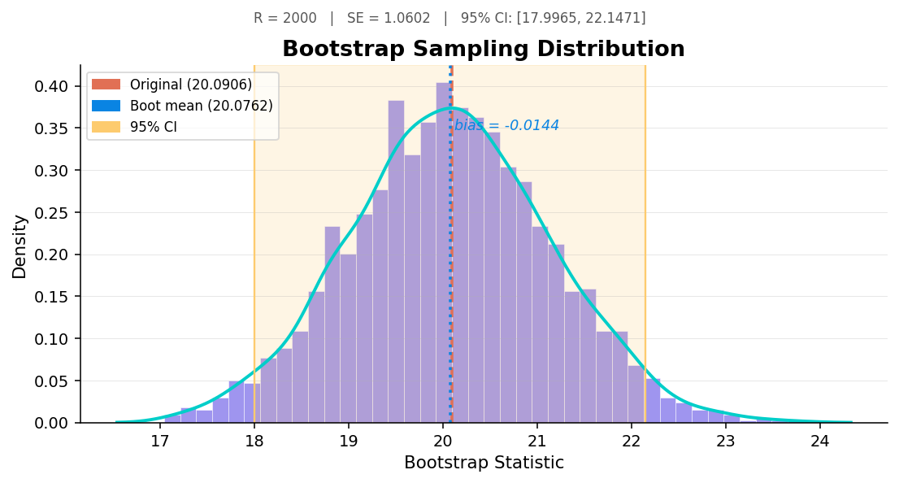
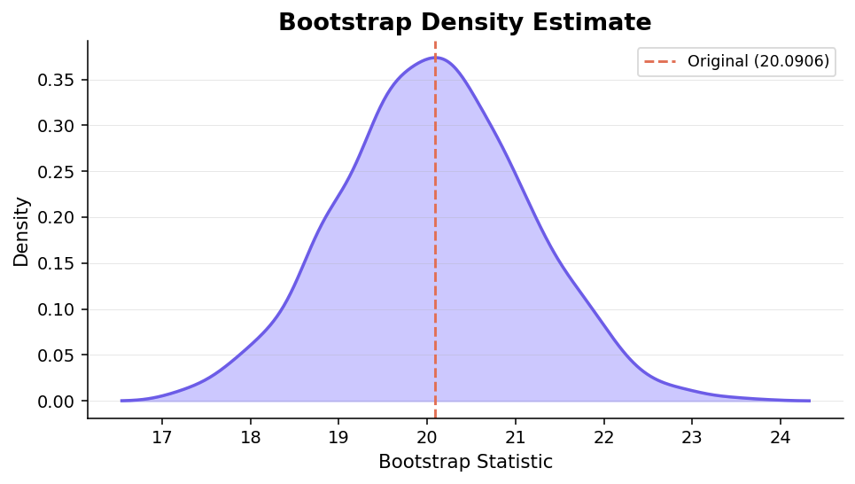
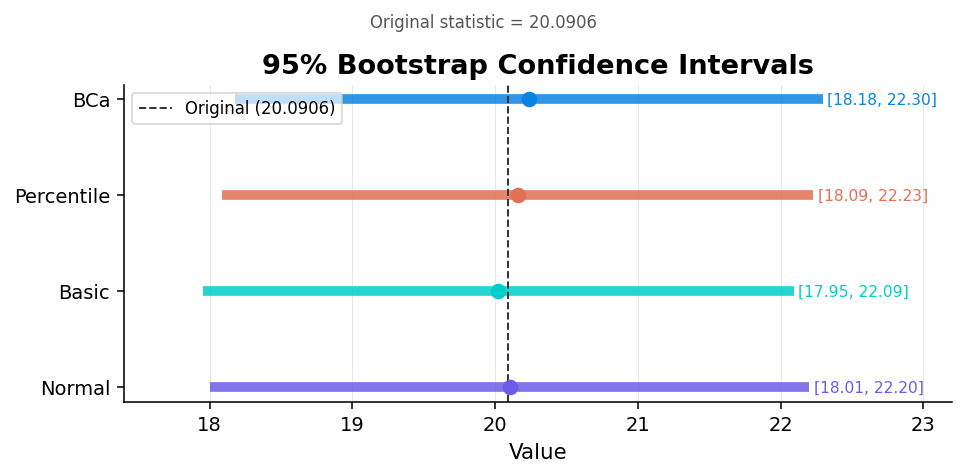
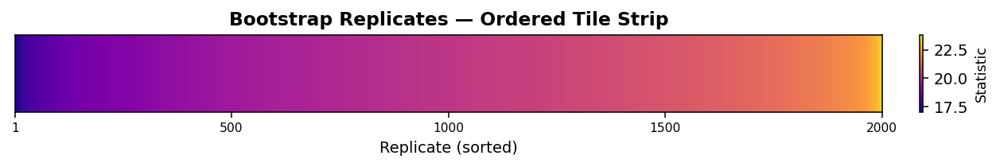
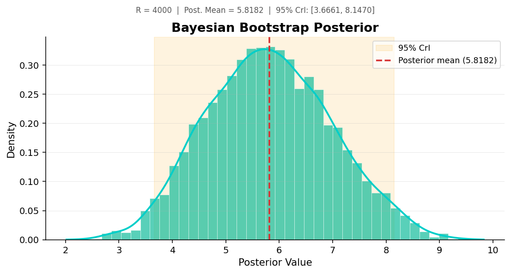

# bootplus

> **Modern Visualization, Interpretation & Bayesian Bootstrap Extensions for R's `boot` Package**
---

## Why bootplus?

The `boot` package is R's gold-standard for bootstrap resampling — but it was designed in an era before `ggplot2`, tidy data, and widespread Bayesian workflows. **bootplus** is a lightweight extension layer that adds three things `boot` is missing:

| Capability | Functions |
|---|---|
| **Visualization** | `boot_viz()`, `boot_density()`, `boot_ci_plot()`, `boot_dist_plot()` |
| **Interpretation** | `boot_interpret()`, `boot_compare_ci()`, `boot_report()` |
| **Bayesian Bootstrap** | `boot_bayes()`, `boot_bayes_plot()` |

**bootplus does not replace `boot`** — it works directly with `boot` objects and adds what's missing.

---

## Installation

```r
# Install from GitHub (devtools required)
devtools::install_github("aastha-chhabra/Bootplus")
```

---

## Quick Start

### 1. Classical Bootstrap - Visualize & Interpret

```r
library(boot)
library(bootplus)

# Bootstrap the mean of mpg
set.seed(42)
b <- boot(mtcars$mpg, function(d, i) mean(d[i]), R = 2000)

# Beautiful distribution plot with CI shading
boot_viz(b)
```



> **Purple histogram** = bootstrap distribution · **Teal curve** = KDE · **Orange dashed** = original statistic (20.0906) · **Blue dotted** = bootstrap mean · **Yellow band** = 95% CI

```r
# Human-readable interpretation
boot_interpret(b)
#> Bootstrap Analysis (R = 2000)
#> Original statistic : 20.0906
#> Bootstrap mean     : 20.0754
#> Bias               : -0.0152  (negligible)
#> Std. Error         : 1.0632
#> CV                 : 5.29%
#> 95% Percentile CI  : [18.0422, 22.1406]
#> Interpretation:
#> The original sample statistic is 20.0906.
#> Across 2000 bootstrap replicates the mean estimate is 20.0754, giving a bias of -0.0152 (ratio |bias|/SE = 0.014, deemed negligible).
#> The bootstrap standard error of 1.0632 quantifies sampling uncertainty. 
#> A 95% percentile confidence interval is [18.0422, 22.1406].
```

---

### 2. Bootstrap Density Plot

```r
boot_density(b)
```



> A streamlined filled-density view. The **orange dashed line** marks the original statistic. Ideal for quick distributional checks in reports.

---

### 3. CI Method Comparison

```r
# Compare CI methods
boot_ci_plot(b)
```



```r
boot_compare_ci(b)
#>       method   lower   upper   width
#> 1     Normal 18.0065 22.2001  4.1936
#> 2      Basic 17.9531 22.0906  4.1375
#> 3 Percentile 18.0906 22.2281  4.1375
#> 4        BCa 18.1812 22.2969  4.1157
```

> Each method (Normal, Basic, Percentile, BCa) is shown as a coloured horizontal bar. The **dashed vertical line** is the original statistic. BCa is the most robust but requires adequate bootstrap replicates (R ≥ 1000 recommended).

---

### 4. Replicate Tile Strip

```r
boot_dist_plot(b)
```



> Each pixel column is one bootstrap replicate, sorted by value and coloured by the **plasma** viridis palette. Outlier replicates and distributional skew are immediately visible.

---

### 5. Bayesian Bootstrap

```r
x <- c(2, 4, 5, 8, 10)
weighted_mean <- function(data, weights) sum(data * weights)

bb <- boot_bayes(x, weighted_mean, R = 4000, seed = 42)
print(bb)
#> Bayesian Bootstrap
#> Draws (R)          : 4000
#> Posterior mean     : 5.7993
#> Posterior median   : 5.7268
#> Posterior SD       : 1.4112
#> 95% Credible Int.  : [ 3.1752 , 8.6273 ]

# Posterior density plot
boot_bayes_plot(bb)
```



> **Green histogram + teal KDE** = Dirichlet-weighted posterior · **Yellow band** = 95% credible interval · **Red dashed** = posterior mean. Unlike the classical bootstrap, Bayesian bootstrap draws are weighted by a Dirichlet(1,…,1) prior — giving a smoother, continuous posterior.

---

### 6. Full Report

```r
boot_report(b)
#> Bootstrap Analysis (R = 2000)
#> Original statistic : 20.0906
#> Bootstrap mean     : 20.0754
#> Bootstrap median   : 20.0859
#> Bias               : -0.0152  (negligible)
#> Std. Error         : 1.0632
#> CV                 : 5.29%
#> 95% Percentile CI : [18.0422, 22.1406]
#>
#> Confidence Interval Comparison
#> Method          Lower        Upper        Width
#> --------------------------------------------------
#> Normal          18.0065      22.2001      4.1936
#> Basic           17.9531      22.0906      4.1375
#> Percentile      18.0906      22.2281      4.1375
#> BCa             18.1812      22.2969      4.1157
#>
#> Diagnostics
#>   Skewness (approx) : 0.0341
#>   Kurtosis (excess) : -0.0512
#>   No NA replicates.
#>
```

---

## Function Reference

### Visualization

| Function | Description |
|---|---|
| `boot_viz()` | Histogram + density + CI shading + bias annotation |
| `boot_density()` | Streamlined filled density plot |
| `boot_ci_plot()` | Horizontal interval comparison (Normal, Basic, Percentile, BCa) |
| `boot_dist_plot()` | Ordered tile-strip of all replicates |

### Interpretation

| Function | Description |
|---|---|
| `boot_interpret()` | Structured summary with bias assessment & narrative |
| `boot_compare_ci()` | Tidy data frame of CI methods with widths |
| `boot_report()` | Full report: interpretation + CI table + skewness/kurtosis |

### Bayesian Bootstrap

| Function | Description |
|---|---|
| `boot_bayes()` | Rubin's (1981) Dirichlet-weighted Bayesian bootstrap |
| `boot_bayes_plot()` | Posterior density with credible interval shading |

---

## Package Workflow
`bootplus` extends the `boot` package with three post‑processing functions: `boot_viz()` (visualisation), `boot_interpret()` (interpretation), and `boot_report()` (report generation). It also adds a Bayesian bootstrap workflow via `boot_bayes()` and `boot_bayes_plot()`. All plots are built with `ggplot2`.

- **Non-invasive**: Works with existing `boot` objects — no custom classes needed for classical bootstrap.
- **Composable**: Every visualization function returns a `ggplot` object you can further customize.
- **Teach-friendly**: `boot_interpret()` explains results in plain language.

---

## Dependencies

- **R** ≥ 3.5.0
- **boot** (ships with R)
- **ggplot2** ≥ 3.4.0

---

## References

- Davison, A.C. & Hinkley, D.V. (1997). *Bootstrap Methods and Their Application*. Cambridge University Press.
- Efron, B. & Tibshirani, R.J. (1993). *An Introduction to the Bootstrap*. Chapman & Hall/CRC.
- Rubin, D.B. (1981). The Bayesian Bootstrap. *Annals of Statistics*, 9(1), 130–134.
